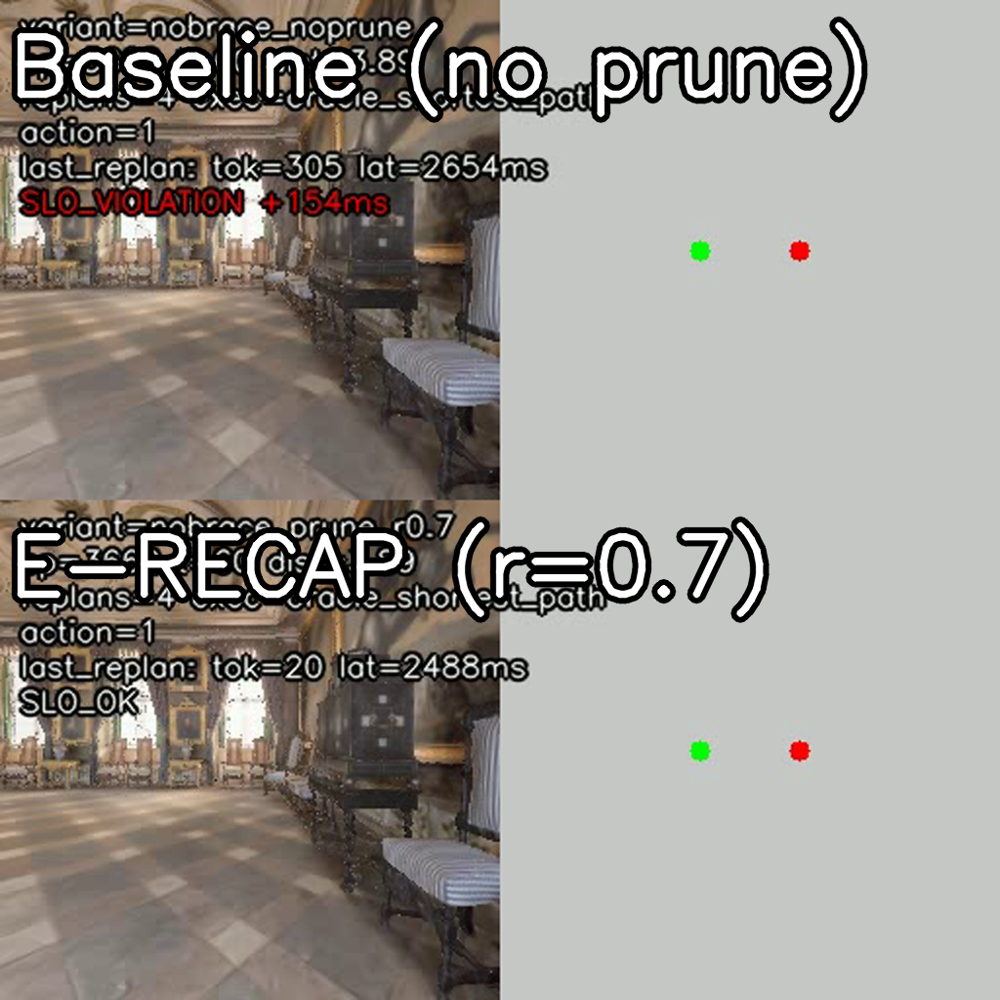
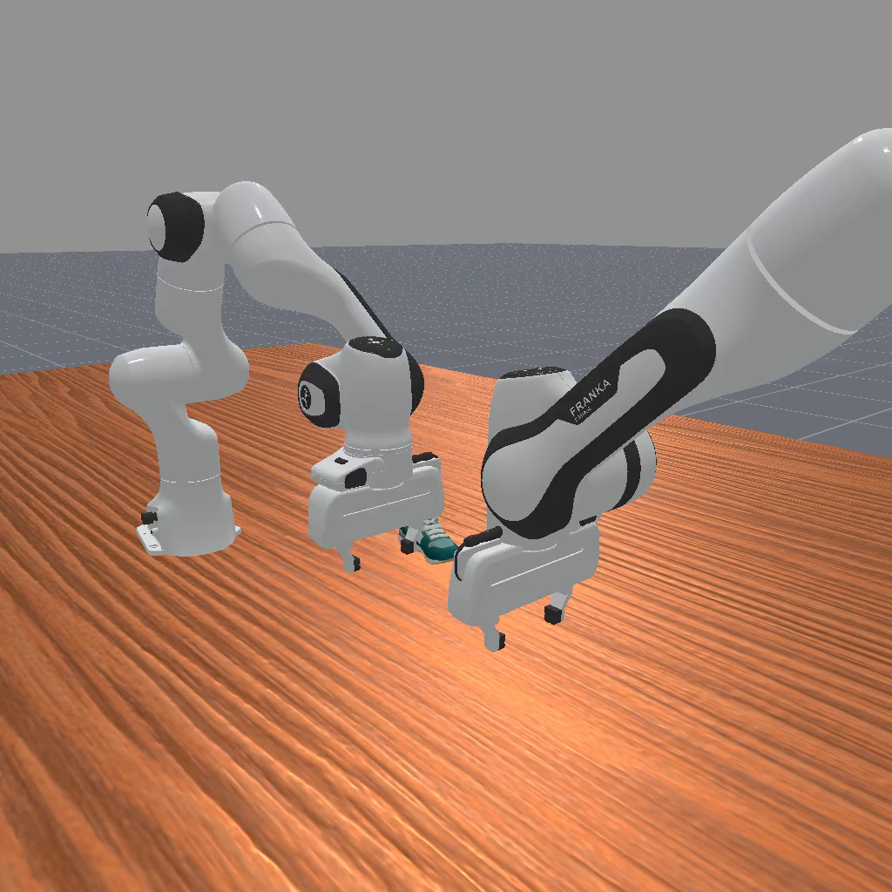

  <h1 style="display: inline-flex; align-items: center; justify-content: center; gap: 10px; margin: 0; vertical-align: middle;">
    <picture style="display: inline-block; vertical-align: middle; line-height: 1;">
      <source media="(prefers-color-scheme: dark)" srcset="docs/site/static/images/logo_dark.svg">
      
    </picture>
    When Replanning Becomes the Bottleneck: BRACE for Budgeted Embodied Agent Replanning
  </h1>

BRACE treats **high-frequency replanning** as a **systems bottleneck** for embodied agents: repeated replanning under context growth leads to tail latency and SLO violations. We integrate a budgeted replanning controller (BRACE) with auditable logging (phase cost breakdown) and composable efficiency modules (E-RECAP pruning, RAG/memory, budget-matched baselines), evaluated across multiple domains (Habitat, RoboFactory, AirSim) and a VLA executor track (OpenMARL).

## Showcases (representative frames)

| Habitat (Domain A) | RoboFactory (Domain B) | AirSim (Domain C) |
|---|---|---|
|  |  |  |

## Quick links

- Website (static template): `docs/site/index.html`
- Docs (single guide): `docs/README.md`
- Scripts (runnable entrypoints): `scripts/`

## Repo policy (open-source)

This repository is **code + configs + docs only**.

- Do not commit large weights/datasets/videos; keep them under your `BRACE_MODELS_ROOT` / `BRACE_DATA_ROOT` and reference via env vars.
- Local runs/artifacts are generated under `runs/` and `artifacts/` (ignored by git).
