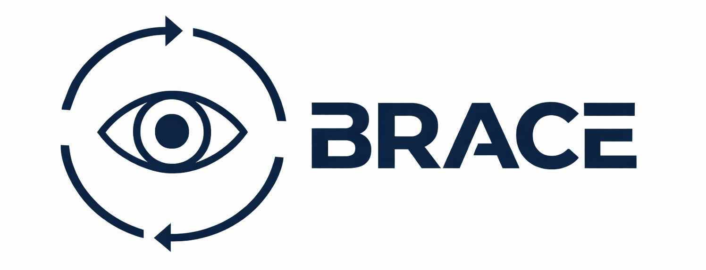
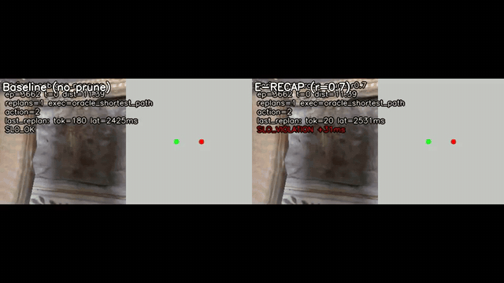
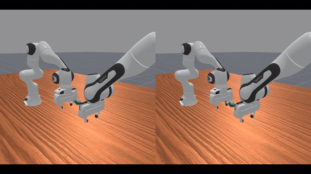

<div align="center">
  <picture>
    <source media="(prefers-color-scheme: dark)" srcset="docs/static/images/logo_dark.png">
    
  </picture>
  <h1>When Replanning Becomes the Bottleneck: BRACE for Budgeted Embodied Agent Replanning</h1>
</div>

<a href="docs/"></a>
<a href="https://anonymous-2026.github.io/BRACE-ICML"></a>
<a href="https://drive.google.com/drive/folders/1Aafo36p2JB8cCeWyG9-QRmEWrssk4kXM?usp=sharing"></a>
<a href="https://www.deepspeed.ai/"></a>
<a href="https://github.com/microsoft/AirSim"></a>
<a href="https://aihabitat.org/"></a>
<a href="https://github.com/MARS-EAI/RoboFactory"></a>

**BRACE** = **B**udgeted **R**eplanning and **C**oordination for **E**mbodied **A**gents.

BRACE treats **high-frequency replanning** as a **systems bottleneck** for embodied agents: repeated replanning under context growth leads to tail latency and SLO violations. We integrate a budgeted replanning controller (BRACE) with auditable logging (phase cost breakdown) and composable efficiency modules (E-RECAP pruning, RAG/memory, budget-matched baselines), evaluated across multiple environments (Meta AI Habitat / Habitat-Lab+Habitat-Sim navigation, RoboFactory manipulation, Microsoft AirSim vehicles/drones) and a VLA executor track (OpenMARL).

## Showcases (short video loops)

**Microsoft AirSim (cinematic)**


**Meta AI Habitat (tail/SLO)**



**RoboFactory (coordination)**



### What are these 3 demos (tasks)?

These GIF/MP4 loops are **qualitative “baseline vs BRACE” comparisons** (kept small for the website). Concretely:

- **Habitat (navigation): PointNav / Goal-reaching replanning under tight SLO**
  - Task: **PointNav** (navigate to a target goal in indoor scenes), with replanning enabled to recover from noise/failures.
  - What you see: baseline experiences **tail latency + SLO violations** as replanning context grows; BRACE (with budgeting + optional pruning) keeps replanning within budget, improving SLO adherence while maintaining success.
- **RoboFactory (manipulation): multi-arm “PassShoe” handover + placement**
  - Task: **PassShoe-table / PassShoe-rf** — two Panda arms **handover a shoe** and place it into a goal region (multi-agent coordination with frequent replans).
  - What you see: baseline shows longer waits / coordination stalls; BRACE reduces replanning overhead and stabilizes coordination (less churn/wait).
- **AirSim (vehicles/drones): multi-agent intersection-style scenario with frequent replanning**
  - Task: **AirSimNH multi-agent intersection** (multiple vehicles/drones traversing constrained space), forcing high-frequency replanning to avoid conflicts.
  - What you see: baseline suffers from heavy tail replanning latency; BRACE keeps replanning within budget and produces a more stable/smooth closed-loop trajectory.

Full MP4 clips (for the website) live in `docs/static/videos/` and are embedded in `docs/index.html`.

## Quick links

- Website (static template): `docs/index.html`
- Docs (single guide): `docs/README.md`
- Controller spec (proxy-ready): `docs/CONTROLLER.md`
- Logging schema: `docs/SCHEMA.md`
- Analysis utilities: `analysis/README.md`
- Demo/media provenance: `docs/PROVENANCE.md`
- Configs: `configs/smoke/` (defaults) and `configs/experiments/` (curated eval/demo configs)
- E-RECAP (v1) module: `docs/e-recap.md` / `e-recap/`
- Scripts (runnable entrypoints): `scripts/`

## Minimal smoke (no simulators)

```bash
scripts/smoke_local.sh
```

## Repo policy (open-source)

This repository is **code + configs + docs only**.

- Do not commit large weights/datasets/videos; keep them under your `BRACE_MODELS_ROOT` / `BRACE_DATA_ROOT` and reference via env vars.
- Local outputs are generated at runtime (e.g., `runs/`, `artifacts/`, `data/`) and are **not** shipped in this repo. See `docs/LOCAL_OUTPUTS.md`.
